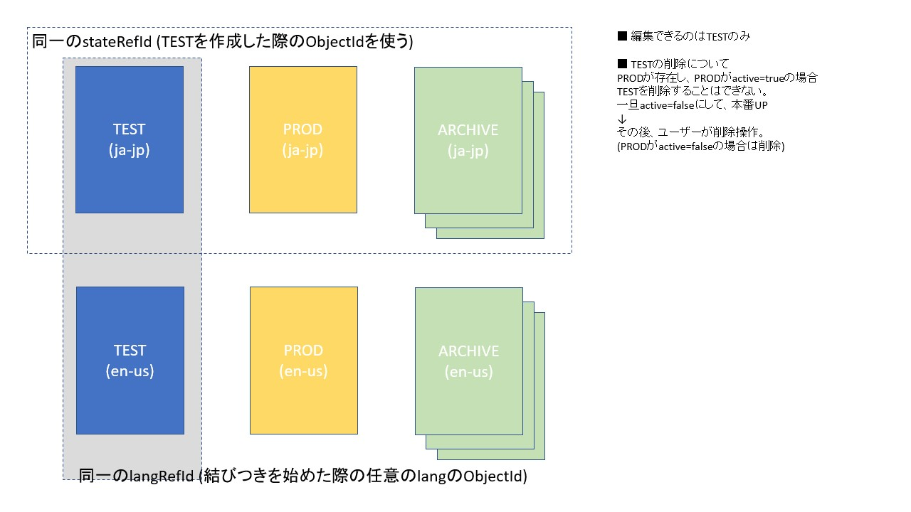

# WEBカタログ開発ドキュメント

- [Markdown cheat](https://gist.github.com/mignonstyle/083c9e1651d7734f84c99b8cf49d57fa)
- //TODO の項目は書きかけ、未定です

## ■主な機能

#### シリーズ

- ガイド1つに相当
- 複数言語版が存在。言語間で結び付きがある。(1言語、1レコード)
- 多言語対応(日、英、中)
- 各々は結びついている
- ただし、各々は別のIDをもつ1レコードとする(操作は1言語単位)
- シリーズ下位(製品詳細)、取扱説明書一覧、など、テーブルのような2次元構造をもつものはJSONなどで1カラムに格納する
(Excelのような入力フォームがあるとよい、カラムは追加、削除、並び替えができる)
- PDF- 画像なども紐付けられる
- シリーズは複数のカテゴリに属する
- 編集- 削除- 並び替えができる
- 表示- 非表示が制御できる
- 管理系での検索ができる(検索項目指定可能)
- 項目指定での一括置換ができる(危険)
- ステータスの付与(テスト中- テストOK etc.)-->一覧でみられる
- 最終編集者、時刻の記録
- バージョン管理
  - 過去のバージョンを残すことができる(明示的に指示、メモ入力可)
  - 過去のバージョンに戻すことができる
  - 過去のバージョンと比較することができる(項目単位)

#### カテゴリ

- 多言語対応(日、英、中)
- 各々は結びついている
- ただし、各々は別のIDをもつ1レコードとする
- カテゴリは言語ごとに別のツリー(並び順- 構造)を持つ
- 編集- 削除- 並び替えができる
- 表示- 非表示が制御できる
- スラッグを持てる  
(階層内一意 aaa/bbb/ccc -> URLとして aaa-bbb-cccのようにアクセス可能にする?)
- カテゴリの種類(製品のカテゴリ、PGのリンクetc)
- 画像の管理-->外部
- //TODO カテゴリショートカット エリイアス(どのように実現するか??)
- カテゴリに対しての説明、リンクなどHTML記述
- ルートカテゴリはカテゴリのタイプを指定。WEBカタログ以外の階層も使用可能。
- カテゴリツリーの例

  - WEBカタログ
    - 方向制御機器
    - エアシリンダ
      - 標準型エアシリンダ
      - コンパクトエアシリンダ
    - ...
  - 特設スイッチセンサ
    - センサ一覧表示用

#### テスト->本番へのUPの流れ
- テストサーバーと本番サーバーは別のDBを持っている
- 個別UP
- 全体UP
言語ごとに、カテゴリとシリーズをすべて同期できる
- カテゴリのUP
各カテゴリ配下のすべての情報(シリーズ- 並び順含む)を本番UP

#### データ出力
- CSVでのダウンロードができる
- JSON応答ができる(REST API)

## ■Model,Property概要

#### カテゴリModel (Category)

- 改装構造を持つ(子は親のidを持つ)
- 言語ごとに異なるツリーを持つ
- //TODO エイリアスはリンク先のidを持つ
- 同一階層内で並び順を持つ
- ARCHIVE不要

#### シリーズModel (Series)

- //TODO 属するカテゴリのidを複数持つ(DbRef?)
- UserをDbRef
- //TODO DbRefしたカテゴリ、Userが削除された場合の処理

#### カテゴリとシリーズの結びつき (CategorySeries)

- カテゴリとシリーズはManyToManyの関係
- CategorySeries.seriesList(List<Series>)を@DbRef

#### 重要プロパティ

- 以下のプロパティは取得メソッド(一覧表示etc.)に、パラメーターとして渡し、表示切り替えができるようにしておく  
(テスト一覧、本番一覧、言語ごと、公開/非公開etc)
- stateプロパティ
  - 各Modelは以下のステートを持つ、アーカイブに関しては複数存在
    - TEST テスト版
    - PROD 本番版
    - ARCHIVE アーカイブ(複数存在)
  - 1つのSeriesに関して、上記ステートを持つ、3つの版が存在する
  - CategoryはARCHIVE不要
  - Modelはテスト -> 本番公開の流れで編集される。
  - それぞれはsateRefIdで結びつく(stateRefIdは作成時に作成元のモデルのidを使用)
  - アーカイブは本番公開をする際に、「この公開をアーカイブにする」ことで、保存される。
  - モデル図はこちら  
  
- langプロパティ
  - 言語はja-jp,en-usなど複数存在
  - 各Modelは言語ごとにlangRefIdで結びつく(langRefIdは作成時に作成元のモデルのidを使用)
- activeプロパティ
  - 公開/非公開用フラグ

### ■規約・その他の注意

### プロジェクトディレクトリ
- /etc/ ドキュメントやDBのデータなど
- /lib/ ローカルのライブラリ (\*.jarのみ認識)
- Thymeleafディレクトリは/src/main/resources/templates/ を起点とし、URLに合わせる  
(URLが/login/admin/index.htmlならそのままのフォルダ構成とする)

#### 主なパッケージ
- com.smc.webcatalog.dao -> Template,Repositoryなど
- com.smc.webcatalog.servie  -> Service
- com.smc.webcatalog.web  -> Controller
- com.smc.webcatalog.config -> CongigRation類
- com.smc.webcatalog.api -> RestController

#### アプリケーション初期処理
- com.smc.webcatalog.config.Initで@PostConstruct

#### メッセージリソース
- /src/main/resources/messages.properties -> メッセージリソース(ja)
- /src/main/resources/messages_en.properties -> メッセージリソース(en)
- /src/main/resources/ValidationMessages.properties -> Validation用メッセージ(ja)
- /src/main/resources/ValidationMessages_en.properties -> Validation用メッセージ(en)  
(必要に応じて各国版を用意)

### 命名規則
- クラス : サービスクラスは..Serviceなどわかりやすいものを
- Model : 規則なし(入力フォームは モデル名+Form)
- プロパティ : Modelのプロパティには _ を使わない

#### DaoとService
- Daoは..Repository(Interface)を主体としてAutowired
- ..RepositoryはMongoRepository継承
- ..TemplateはMongoTemplateを使用可能
- ..Repositoryは ..Template(Interface)と..TemplateImpl(実装)を継承する  
(これにより、RepositoryとTemplateを共用)
- 基本的にDaoの各メソッドはServiceからラップして使用する  
(Serviceで処理する場合に、Daoのメソッドを複数束ねて処理する.etc)
- Controllerからはサービスを呼ぶ
- //TODO 各BeanのScopeをしっかり決める(session?,request?)

#### Eclipseのタスク
- タスクビューから見やすいように、TODO,FIXMEなどを使用する

#### //TODO ユーザー、認証
- ユーザーごとに、apiをCall時の挙動をかえる(製品画像のパスprefixなど)

#### //Restにする?

#### ロギング
- @lombok.extern.slf4j.Slf4j により、"log.---"の記述だけでロギング可  
開発環境のログレベルはdebugなので、冗長ログはdebugに、必須ログはinfoに

### Gitブランチ
- developブランチを統合ブランチとして扱う(masterは更新不可)
- ローカルでは自分でさらにブランチを切る

#### //TODO デプロイ
- デプロイ時は.warにする予定
